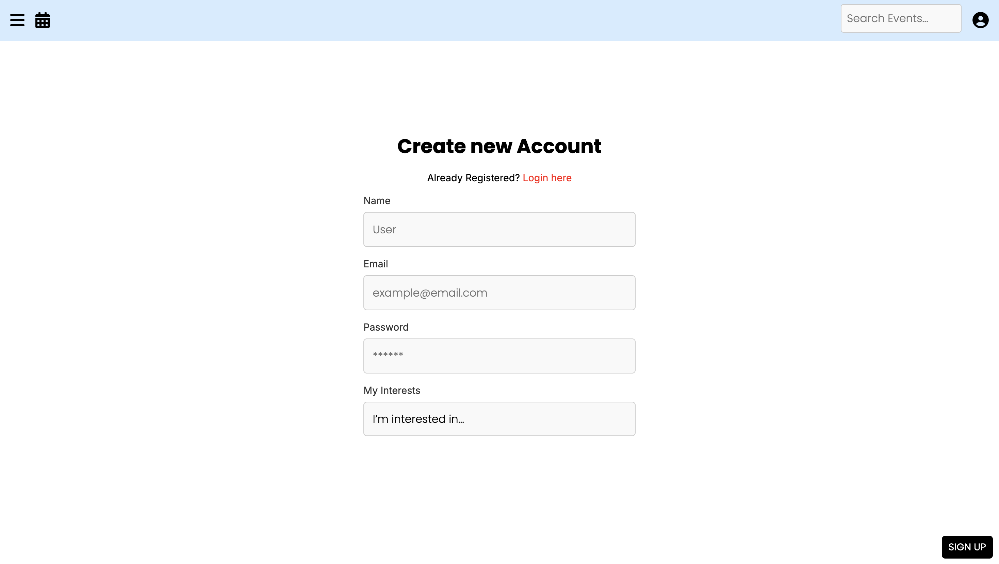
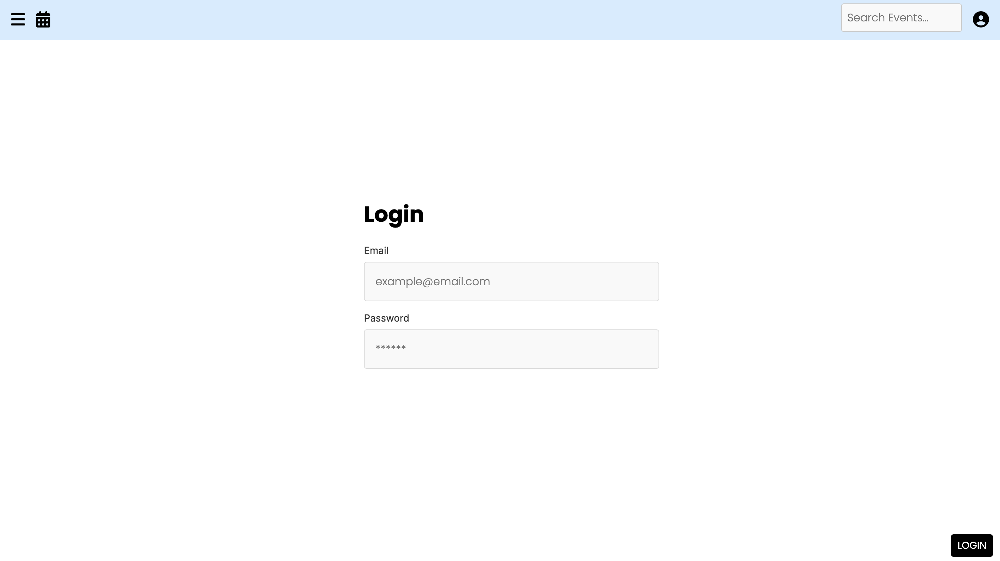
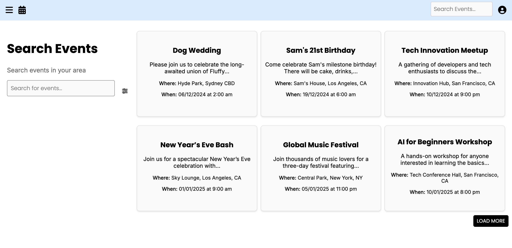
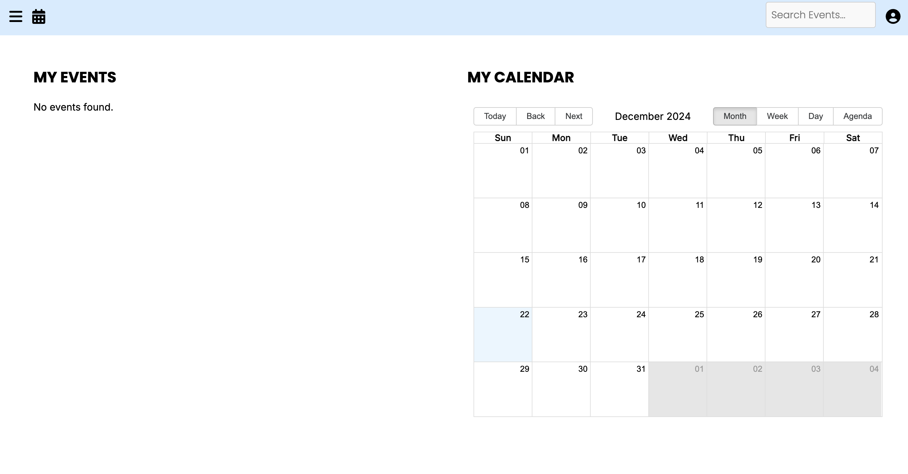

# Link to Part A ReadMe 
[Part A Readme](https://github.com/hsc996/EventScape-T3A2-A/tree/main)

# EventScape

Link to the deployed website [here:](https://eventscape1.netlify.app/)

# Acknowledgement of Discrepancies: Part A vs. Part B

In order to remain accountable, we would like to acknowledge some discrepancies between the planning designs and the final product. Firstly, the user profiles/follow functionality outlined in the inital plans have not been implemented due to time constraints.

This, in turn, ultimately affected our ability to implement the "invitees" list in an aesthetic manner. While  we attempt to pivot strategy and allocate placeholder icons instead, this was also not achieved due to time constraints. However, we decided to retain the list of user IDs on the event pages in order to demonstrate the underlying logic intended for the feature.

Similarly, the original design included theme controllers in the API. Upon further evaluation, we realised that the theme management could be handled seamlessly via the frontend. In this way, we only needed to update the Event schema to log the title of the theme selected by the user. As a result, the theme controllers became redundant, but we decided to retain them in the API to promote flexibility for potential future use cases.

Additionally, several API routes remain un-used in the current product. While a lot of these endpoints reflect stretch goals in the first place, these endpoints remain in the API in case we are able to refine the application and include these features in the future. For example, the feature to find all active events a user is hosting; intended for a dedicated tab where users could track their hosted events. This wasn't included in the original plan, but was included so as not to limit the capabilities of the API.

For the **wireframes** The main change made was to the Create Event page, which I paired back due to the timeframe. I simplified the themes to have just a colour scheme and background picture rather then the choice of mulitple images I intended to have. 

Please see screenshots of the deployed apps webpages below:

# Libraries Used

We also made added additional libraries to the app as the need came up during development. 

Frontend Libraries added: 
- Preact for keeping app updates fast and automatically optimising app state 
- Moment-timezone for time-zone management
- add-to-calendar button
- React-big-calendar library for rendering the multi-view calendar 

# Continued planning and updated Trello progress
We continued with the agile kanban methodology to keep track of our progress and what was still left to do. Tasks were broken into smaller, manageable components (e.g., "Test CRUD operations," "Create Theme Toggle logic"), aligning with Agile's emphasis on delivering value iteratively. Agile sprints are represented through soft deadlines we set on tasks, promoting a focus on short-term goals.Continuous testing can also been seen in our process. 
Please see screenshots below:

# Testing

## Express.js API Testing

### Manual Testing

We tested the API in Bruno using the local development link to ensure functionality during development. This was further validated by testing the deployed API link in Bruno, confirming consistent behaviour in the production environment. We then completed a manual testing spreadsheet in order to accurately track the tests performed. Despite testing all of the endpoints successfully, we were unable to complete a manual testing sheet for each endpoint due to time constraints.

### Unit & Integration Testing

We implemented integration tests for all user routes to ensure reliability and robustness in handling cor functionalities like fetching profiles, updating details and deleting accounts. Using Jest, we mocked dependencies such as UserModel and validateUserAuth middleware to isolate application logic and simulate real-world interactions with supertest.

Our tests covered both success and failure scenarios, validating proper handling of edge cases, such as non-existent users, duplicate usernames and invalid input. I focused on clear error responses, correct status codes and meaningful feedback for users.

This approach ensured thorough coverage, improved security, and maintained test clarity, providing confidence in the application's behaviour under real-world conditions.

Furthermore, we designed integration tests to validate the behaviour of the API endpoints and middleware, focusing on root routes, CORs headers and controller endpoints. These tests ensure the application responds as expected under various conditions.

   * Root API Tests: Verified endpoint returns the correct message and status code, and confirmed no Authorization header is present in the response when not providied.

   * CORS Validation: Ensured the application handles both valid and invalid Origin headers, allowing orrejecting requests based on CORS policies.

   * Controller Endpoints: Tested multiple endpoints (/account, /user, /event, etc.) to confirm appropriate 404 responses for unhandled routes, ensuring users receive clear feedback on unavailable resources.

Individual unit tests were also performed on both RSVP and Auth routes. Ideally, we would have perform integration tests on all routes in the application, but were unfortunately unable to do so due to time constraints.

## Client Testing

### Manual testing

User tests were done to ensure that the production env and the deployed site were routing and rendering components as expected. 

Deployed app render/route testing: 

Production render/route testing:

## REFERENCES

GeeksforGeeks (2024) _Event Management Web App using MERN_, GeeksforGeeks [Preprint]. Available at: https://doi.org/10/2628/2963/7726/7835.

S, Y. (2021). _What exactly a MERN stack is?_ [online] Medium. Available at: https://medium.com/techiepedia/what-exactly-a-mern-stack-is-60c304bffbe4.

Visual Paradigm. (2024). _DFD Tutorial: Yourdon Notation._ [online] Available at: https://online.visual-paradigm.com/knowledge/software-design/dfd-tutorial-yourdon-notation.

